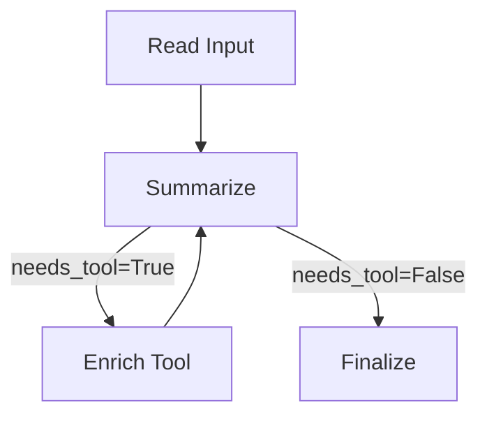

# Agentic-AI-With-LangGraph
---

# 🌟 **LangGraph — Basic Project Scaffold**

*A clean, modular starter template for building graph-based AI agents.*

---

## 🔖 Badges


---

## 🎯 **What This Project Is**

This repository is a **minimal, easy-to-understand template** showing how to build LangGraph-style agent workflows using:

* 📌 simple nodes
* 📌 a tiny executor
* 📌 loop logic
* 📌 RAG-style flows
* 📌 clean modular structure

It focuses on **clarity and modularity**, perfect for beginners, portfolio use, or teaching agent architecture.

---

## 🧱 **Project Structure**

```
langgraph-basic/
├─ README.md
├─ requirements.txt
├─ .env.example
├─ langgraph_module/
│  ├─ __init__.py
│  ├─ nodes.py
│  └─ executor.py
├─ examples/
│  ├─ simple_example.py
│  └─ rag_example.py
└─ diagrams/
   └─ example-flow.txt
```

---

## 🚀 **Features**

### 🟦 1. Simple Modular Nodes

Each step (LLM call, tool, retrieval, validator) is written as a **pure function** returning a `state` dict.

### 🟥 2. Tiny Deterministic Executor

A minimal executor handles:

* sequential steps
* loops
* stop rules

### 🟩 3. Two Working Examples

✔ **simple_example.py** → Summarization + enrichment loop
✔ **rag_example.py** → Minimal RAG workflow with validation

### 🟪 4. Mock LLM Included

A `FakeLLM` class simulates responses so you can run everything **without API keys**.

---

## ⚙️ **Setup Instructions**

### 1️⃣ Create virtual environment

```bash
python -m venv .venv
```

### 2️⃣ Activate it

**Windows**

```bash
.venv\Scripts\activate
```

**Mac/Linux**

```bash
source .venv/bin/activate
```

### 3️⃣ Install dependencies

```bash
pip install -r requirements.txt
```

### 4️⃣ Add API keys (optional)

Copy `.env.example → .env`

```
OPENAI_API_KEY=your_key
```

---

## ▶️ **Run the Examples**

### 🔹 Simple summarization graph

```bash
python examples/simple_example.py
```

### 🔹 RAG agent example

```bash
python examples/rag_example.py
```

---

## 🧩 **Conceptual Graph Flow**



---

## 📚 **Folder-by-Folder Explanation**

### 📂 `langgraph_module/`

* `nodes.py` → all node functions (LLM, tools, retriever, validator, etc.)
* `executor.py` → tiny graph runner
* `__init__.py` → export module components

### 📂 `examples/`

Practical runnable flows.

### 📂 `diagrams/`

Graphviz files for creating flow diagrams.

---

## 🔧 **Extend This Project**

You can expand this into a full LangGraph-style system:

### 🔹 Add memory nodes

### 🔹 Add OpenAI / Anthropic LLM clients

### 🔹 Add vector DB (FAISS, Pinecone, Chroma)

### 🔹 Add multi-agent workflows

### 🔹 Add real branching logic in executor

Tell me if you want me to generate any of these!

---

## 🏁 **Why This Template Exists**

This template gives you a **clean, uncluttered starter** for creating:

* 🚀 agents
* 🚀 tools
* 🚀 knowledge pipelines
* 🚀 instructor demos
* 🚀 portfolio-ready agent projects

Use it to understand the fundamentals without drowning in complex frameworks.

---